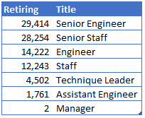

# Pewlett Hackard Analysis

## Purpose
Pewlett Hackard is a large multi-national company that is preparing for a large exodus of employees from the Baby Boomer generation.  Using corporate personnel information, PH wants to determine the number of imminent retirements and the number of positions that will need to be filled.  

## Data Sources
Data was provided in the following 6 tables and copies maintained int the GitHub .
* departments.csv
* dept_emp.csv
* dept_manager.csv
* employees.csv
* salaries.csv
* titles.csv

## Methodology
To produce the required data, the following steps were taken:
* Design an Entity Relations Diagram using 
* Create and use SQL database.
* Import and export large CSV datasets into pgAdmin.

## Deliverables 
1. Determine the number of retiring employees by title.   
2. Determine the employees eligible for the Mentorship program.  
3. Provide a written report on the employee database analysis.  

## Results
* Table 1

* 

* 

* 
  
## Summary
* Table 1

* 

* 

* 
  

----------------------------------------------------------------------------------
### Appendix of Figures and Tables
----------------------------------------------------------------------------------

 
 
**Table 1: Retirement by Title**
 
 
 

 
 
**Fig. 2:  Fares Through Time**
 
 
 

 
**Table. 1: Ride Sharing Summary by City Type**
