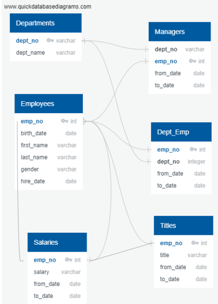
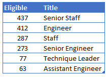
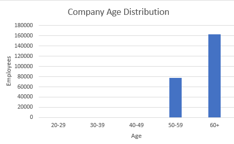

# Pewlett Hackard Analysis

## Purpose
Pewlett Hackard is a large multi-national company that is preparing for a large exodus of employees from the Baby Boomer generation.  Using corporate personnel information, PH wants to determine the number of imminent retirements and the number of positions that will need to be filled.  

## Data Sources
Data was provided in the following 6 tables and copies maintained in the GitHub .
* departments.csv
* dept_emp.csv
* dept_manager.csv
* employees.csv
* salaries.csv
* titles.csv

## Methodology
To produce the required data, the following steps were taken:
* Design an Entity Relations Diagram using  as shown in Figure 1.  
* Create and use SQL database.
* Import and export large CSV datasets into pgAdmin.

## Deliverables 
1. Determine the number of retiring employees by title.   
2. Determine the employees eligible for the Mentorship program.  
3. Provide a written report on the employee database analysis.  

## Results
* The queries for this project are compiled and saved within the GitHub .
* The resultant project query outputs are compiled and saved within the GitHub .
* Table 1 provides the results to the number of employees retiring by title.  Future losses will be felt most in the areas of Senior Engineer and Senior Staff.  
* A total of 90,398 employees are eligible for retirement soon.  Of which, 64% are in the Senior Engineer and Senior Staff job buckets.  
* Employees eligible for mentorship, provided in Table 2, as a percentage, align with data provided in Table 1.  Ff the 1,549 employees eligible for mentorship, 55%  are in the Senior Engineer and Senior Staff job buckets.
  
## Summary
* PH must implement a strategy to develop talent in key leadership roles (Senior Engineer and Senior Staff).  
* Figure 2 sheds light into the age distribution within PH.  All current employees are age 50 or older. 
* Nearly 40% of PH's current workforce will be eligible for retirement in the coming years.  
* PH must agressively hire and train younger employees to fill the upcomming talent void with the upcomming wave of Baby Boomers retiring.  
* PH must develop a strategy to attract and maintain a younger workforce in order to maintain its prescence in the market.  

----------------------------------------------------------------------------------
### Appendix of Figures and Tables
----------------------------------------------------------------------------------

 
 
**Fig. 1:  Entity Relations Diagram**
 
 
 
 
 

 
 
**Table 1: Retirement by Title**
 
 
 
 
 

 
**Table 2: Eligible for Mentorship by Title**
 
 
 
 
 

 
**Fig. 2: Company Age Distribution**

